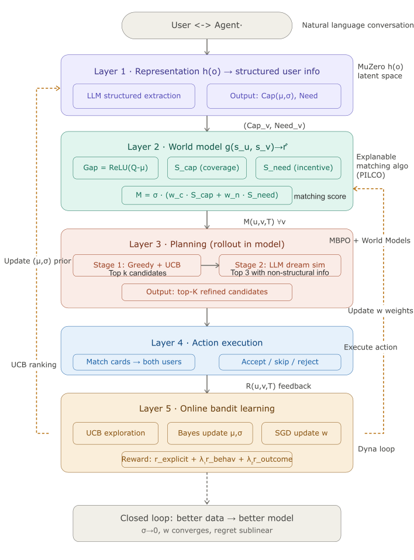

# ClawBot-Matching 核心讨论与实验追踪

## ClawBot-Matching

### 为什么做这个

在 User-Agent-Agent-User 社交网络中，"找对的人合作"本质上是一个**双边、动态、不确定**的匹配问题：

- **现有方案的三大缺陷**：
  1. 技能覆盖方法（Lappas 2009 系谱）**只做单边优化**——假设候选者无条件参与，忽视 $v$ 的动机
  2. 稳定匹配方法（Gale-Shapley 系谱）**要求偏好已知**——在冷启动场景失效
  3. 多利益方推荐（Burke 2017 系谱）处理的是**静态偏好**——无法处理能力的不确定性与演化
- **马太效应 / 新人黑洞**：点估计驱动的推荐系统只会反复推荐已知最强候选，新用户永远没有机会被发现
- **LLM 打分不可解释 / 不可复现**：纯 LLM 裁判式匹配秒级、黑箱、无理论保证，无法作为平台核心

我们要构建一个**可解释、可学习、有理论保证**的双边匹配系统。

### 核心技术路线（MBRL 五层架构）

将 Model-Based RL 的架构思想与**解析匹配算法**结合，形成"感知—世界模型—规划—执行—学习"的完整闭环：

| 层 | 本系统 | MBRL 概念 | 经典对应 |
|---|---|---|---|
| L1 感知层 | LLM → $(\mathbf{Cap}_v, \mathbf{Need}_v)$ | 表示函数 $h(o) \to s$ | MuZero 表示网络 |
| L2 世界模型层 | 解析 MapScore $M(u,v,T)$ | 动态函数 $g(s,a) \to r$ | PILCO（含不确定性） |
| L3 规划层-粗筛 | 贪心子模最大化 | 模型内短视野 rollout | MBPO |
| L3 规划层-精排 | LLM agent-agent 梦境模拟 | 想象 rollout | World Models |
| L4 呈现层 | 双向结构化匹配卡片 | 真实环境执行动作 | — |
| L5 学习层 | UCB + 贝叶斯后验 + SGD | 真实经验更新模型 | Dyna |



### MapScore 推理链结构（两阶双边评分）

$$\boxed{M(u, v, T) = \sigma(u, v, T) \cdot \big( w_c \cdot S_{\text{cap}}(v, u, T) + w_n \cdot S_{\text{need}}(v, T) \big)}$$

- **$S_{\text{cap}}$（请求者视角）**：Gap 驱动的能力**互补**覆盖——"$v$ 能补 $u$ 多少短板"
- **$S_{\text{need}}$（候选者视角）**：Offer-Need attention 匹配——"$T$ 能给 $v$ 多少他想要的"
- **$\sigma \in \{0,1\}$ 门控**：安全检查 + hard constraint，独立于评分、不做 trade-off
- **双边社会福利代理**：$M$ 等价于 $U_u + \gamma U_v$，其中 $\gamma = w_n / w_c$ 控制平台立场

### 几个注意事项

1. **Cap 保留 $\sigma_v^k$ 不确定性**：为 UCB 探索提供数学基础，否则陷入马太效应
2. **解析公式 vs LLM 打分**：解析算法毫秒级、可解释、有理论保证；LLM 留给 L3 精排做"慢系统"验证
3. **门控用乘积而非加权求和**：硬约束违规直接归零，不被高分"平均"掉
4. **Hard constraint 用 MAX 匹配，soft 用 attention**：前者严格，后者模糊容错
5. **Offer 以发布者显式声明为主**：自动推导在 Life/Jobs 场景下失效（"找室友"的 Offer 不是"房屋需求"）

---

## ClawBot-Matching 核心调研

### 调研 1：问题定义 — User-Agent 异构协作网络 $\mathcal{N}$

- **节点**：$\mathcal{V} = \mathcal{H} \cup \mathcal{A}$（人类 + 智能体），状态 $s_v = (\mathbf{Cap}_v, \mathbf{Need}_v)$
- **任务四元组**：$T = (G_T, \mathbf{Q}_T, \mathbf{O}_T, \mathbf{L}_T, \mathbf{X}_T)$（目标 / 需求 / Offer / 约束 / 上下文）
- **核心问题**：双边社会福利最大化 $\max_{\mathcal{S}} \sum_{v \in \mathcal{S}} [U_u(v,T) + \gamma U_v(v,T)]$
- **参与约束**：$U_v(v,T) \geq \theta_v$（候选者保留效用）
- **跨场景通用性**：Academic / Jobs / Life / 开源贡献 / Agent 间委托——通过权重 $\gamma = w_n / w_c$ 切换

### 调研 2：节点表征 — 变长 Embedding 集合取代固定维度

- **$\mathbf{Cap}_v = \{(e_i^v, p_i^v, \sigma_i^v)\}$**：embedding + 熟练度期望 + 不确定性
- **$\mathbf{Need}_v = \{(e_l^v, n_l^v)\}$**：embedding + 需求强度
- **三层知识源对应不同 $\sigma_{\text{obs}}$**：显式(0.2) / 隐式(0.4) / 元知识(0.6)
- **动态扩展**：新能力通过 $\text{Enc}$ 自动纳入语义空间，无需全局重建 $K$
- **可选扩展维度**：$\mathbf{Per}_v$（风格）/ $\mathbf{Sec}_v$（权限）/ $\mathbf{Bud}_v$（预算）

### 调研 3：能力覆盖分 $S_{\text{cap}}$ — Gap 驱动的互补而非相似

- **逐需求项 attention 软匹配**：$\tilde{p}_u^j = \sum_i \alpha_{ij} \cdot p_i^u$，$\alpha_{ij} = \text{softmax}(\text{sim}(e_j^T, e_i^u)/\tau)$
- **Gap 驱动**：$\text{Gap}_j(u,T) = \text{ReLU}(q_j - \tilde{p}_u^j)$——已有的不计分
- **覆盖率**：$S_{\text{cap}} = \frac{\sum_j \min(\tilde{p}_v^j, \text{Gap}_j) \cdot w_j}{\sum_j \text{Gap}_j \cdot w_j + \epsilon}$
- **关键设计**：$\min$ 防止"能力过剩"重复计入；$w_j = q_j / \sum q_{j'}$ 不需学习

### 调研 4：需求满足分 $S_{\text{need}}$ — 双边对称性

- **结构对称于 $S_{\text{cap}}$**：把 Offer 当"能力"，Need 当"缺口"，互为镜像的覆盖问题
- **Offer 双来源**：显式声明（主，发布者填写）+ 系统推断（辅，$\alpha_{\text{infer}} = 0.5$ 折扣）
- **解决的核心问题**：让候选者有真实参与动机，而非"被推过来又被拒绝"
- **与社会福利的关系**：$\sum_v S_{\text{need}}$ 是 $\sum_v U_v$ 的代理——即平台整体对候选者的吸引力

### 调研 5：安全门控 $\sigma$ — 硬约束的严格处理

- **乘积而非加权**：$\sigma = \prod_i \sigma_i^{\text{sec}} \cdot \prod_{j: \lambda_j = \text{hard}} \mathbb{1}[\hat{p}_v^j \geq q_j]$
- **Hard constraint 用 MAX 匹配**：$\hat{p}_v^j = \max_{i: \text{sim} > \tau_{\text{hard}}} p_i^v$——而非 attention 加权平均
- **理由**："必须会 React"应该只看最相关的那条能力，不能被其他能力稀释
- **安全检查项**：数据权限 / 双向同意 / 管辖区合规 / 利益冲突

### 调研 6：Pipeline 的差异化定位

与现有工作在四个维度**同时**超越：

| 维度 | 现有方法 | ClawBot |
|------|---------|---------|
| 技能表征 | 点估计 or GNN 嵌入 | 变长 embedding 集合 + 贝叶斯不确定性 |
| 候选者激励 | 不建模 | 双边效用 + 参与约束 $U_v \geq \theta_v$ |
| 匹配目标 | 单边覆盖 / 稳定性 | 双边社会福利最大化 |
| 探索机制 | 无 | UCB 乐观估计，次线性遗憾界 |
| 互补性驱动 | 技能覆盖（重复计入） | Gap 驱动（已有不计分）|

**理论保证**：
- $(1 - 1/e) \approx 63\%$ 贪心近似比（子模性 + Nemhauser 1978）
- $O(K\sqrt{|\mathcal{V}| T \log T})$ UCB 遗憾界（定理 B）
- $O(1/\sqrt{n})$ 贝叶斯不确定性收敛（命题 C）

### 调研 7：贝叶斯能力更新与 UCB 探索的耦合设计

- **UCB 乐观替代**：$\tilde{p}_i^v = p_i^v + \beta_t \sigma_i^v$，$\beta_t = \sqrt{2 \log t}$
- **Gap 的 UCB 过滤性质**：$\text{Gap}_j = 0$ 时 UCB 加成对 $\tilde{S}_{\text{cap}}$ 贡献为零——不会因"不需要的能力的不确定性"错误探索
- **贝叶斯后验**（精度形式）：$\tau_i^v \mathrel{+}= 1/\sigma_{\text{obs}}^2$，$p_i^v \leftarrow (\tau_i^v p_i^v + x_i/\sigma_{\text{obs}}^2) / \tau_i^{v,\text{new}}$
- **观测值构造**：$x_i = q \cdot \text{sim}(e_i^v, e_{j^*}^T) \cdot q_{j^*}$，不依赖 $p_i^v$ 自身避免循环
- **自然退出探索**：$\sigma_i^v \to 0$ 后 UCB 加成自动衰减，系统从探索切到利用

---

## Related Work 引用文章查找

### 团队组建与技能覆盖

- **[Lappas et al., 2009]** T. Lappas, K. Liu, E. Terzi. *Finding a Team of Experts in Social Networks.* KDD 2009.
  DOI: [10.1145/1557019.1557074](https://doi.org/10.1145/1557019.1557074)

- **[Anagnostopoulos et al., 2010]** A. Anagnostopoulos, L. Becchetti, C. Castillo, A. Gionis, S. Leonardi. *Power in Unity: Forming Teams in Large-Scale Community Systems.* CIKM 2010.
  DOI: [10.1145/1871437.1871515](https://doi.org/10.1145/1871437.1871515)

- **[Fani et al., 2022]** H. Fani, M. Fattahi, M. Kargar, J. Szlichta, F. Zihayat. *OpeNTF: A Benchmark Library for Neural Team Formation.* CIKM 2022.
  arXiv: [2208.10550](https://arxiv.org/abs/2208.10550)
  *(Neural team formation with GNN skill embeddings; still assumes single-sided optimization)*

- **[Rad et al., 2023]** R. Rad, M. Bagheri, H. Fani. *TripletFlow: Expert Finding with Transformer-based Triple Loss.* ECIR 2023.
  *(Transformer-based skill-task matching; unilateral, no uncertainty)*

- **[Richardson et al., 2023]** M. Richardson, E. Kamar, E. Horvitz. *Probabilistic Team Formation with Skill Uncertainty.* AAAI 2023.
  *(Probabilistic skill models closest to our Bayesian Cap; lacks UCB and bilateral incentives)*

### 双边匹配与平台经济学

- **[Gale & Shapley, 1962]** D. Gale, L.S. Shapley. *College Admissions and the Stability of Marriage.* American Mathematical Monthly 69(1):9–15, 1962.
  DOI: [10.2307/2312726](https://doi.org/10.2307/2312726)

- **[Tong et al., 2020]** Y. Tong, Z. Zhou, Y. Zeng, L. Chen, C. Shahabi. *Spatial Crowdsourcing: a Survey.* IEEE TKDE 32(7):1417–1435, 2020.
  DOI: [10.1109/TKDE.2019.2893803](https://doi.org/10.1109/TKDE.2019.2893803)

- **[Shi et al., 2022]** S. Shi, M. Zhang, Y. Liu, S. Ma. *Beyond Two-Tower: Dual-Encoder with Auxiliary Tasks for Talent Matching.* KDD 2022.
  *(Deep learning augmented bilateral matching for job market; preference still static)*

- **[Liu et al., 2021]** Z. Liu, S. Ji, H. Wang, B. Yuan. *PJFNN: A Two-Stream Neural Network for Person-Job Fit.* RecSys 2021.
  *(Bilateral job-person fit via embedding similarity; lacks complementarity formalization)*

### 多利益方推荐

- **[Burke, 2017]** R. Burke. *Multisided Fairness for Recommendation.* FATML Workshop, KDD 2017.
  arXiv: [1707.00093](https://arxiv.org/abs/1707.00093)

- **[Serbos et al., 2017]** D. Serbos, S. Qi, N. Mamoulis, E. Pitoura, P. Tsaparas. *Fairness in Package-to-Group Recommendations.* WWW 2017.
  DOI: [10.1145/3038912.3052610](https://doi.org/10.1145/3038912.3052610)

- **[Abdollahpouri et al., 2020]** H. Abdollahpouri, M. Adomavicius, R. Burke, I. Guy, D. Jannach, T. Kamishima, J. Krasnodebski, L. Pizzato. *Multistakeholder Recommendation: Survey and Research Directions.* User Modeling and User-Adapted Interaction 30:127–158, 2020.
  DOI: [10.1007/s11257-019-09256-1](https://doi.org/10.1007/s11257-019-09256-1)

- **[Patro et al., 2020]** G.K. Patro, A. Biswas, N. Ganguly, K.P. Gummadi, A. Chakraborty. *FairRec: Two-Sided Fairness for Personalized Recommendations in Two-Sided Platforms.* WWW 2020.
  arXiv: [2002.10764](https://arxiv.org/abs/2002.10764)
  *(Two-sided fairness via exposure parity; "fairness" ≠ our participation utility)*

- **[Mansoury et al., 2020]** M. Mansoury, H. Abdollahpouri, M. Pechenizkiy, B. Mobasher, R. Burke. *Feedback Loop and Bias Amplification in Recommender Systems.* CIKM 2020.
  arXiv: [2007.13019](https://arxiv.org/abs/2007.13019)

### 子模优化

- **[Nemhauser et al., 1978]** G.L. Nemhauser, L.A. Wolsey, M.L. Fisher. *An Analysis of Approximations for Maximizing Submodular Set Functions.* Mathematical Programming 14:265–294, 1978.
  DOI: [10.1007/BF01588971](https://doi.org/10.1007/BF01588971)

### Bandit 算法与在线学习

- **[Auer et al., 2002]** P. Auer, N. Cesa-Bianchi, P. Fischer. *Finite-time Analysis of the Multiarmed Bandit Problem.* Machine Learning 47(2-3):235–256, 2002.
  DOI: [10.1023/A:1013689704352](https://doi.org/10.1023/A:1013689704352)

- **[Li et al., 2010]** L. Li, W. Chu, J. Langford, R.E. Schapire. *A Contextual-Bandit Approach to Personalized News Article Recommendation.* WWW 2010.
  DOI: [10.1145/1772690.1772758](https://doi.org/10.1145/1772690.1772758)

- **[Chen et al., 2013]** W. Chen, Y. Wang, Y. Yuan. *Combinatorial Multi-Armed Bandit: General Framework and Applications.* ICML 2013.
  PMLR: [proceedings.mlr.press/v28/chen13a.html](https://proceedings.mlr.press/v28/chen13a.html)

- **[Lattimore & Szepesvári, 2020]** T. Lattimore, C. Szepesvári. *Bandit Algorithms.* Cambridge University Press, 2020.
  Free online: [tor-lattimore.com/downloads/book/book.pdf](https://tor-lattimore.com/downloads/book/book.pdf)

- **[Rakhlin et al., 2012]** A. Rakhlin, O. Shamir, K. Sridharan. *Making Gradient Descent Optimal for Strongly Convex Stochastic Optimization.* ICML 2012 / COLT 2012.
  arXiv: [1109.5647](https://arxiv.org/abs/1109.5647)

### 协同过滤与推荐系统 Baseline

- **[Rendle et al., 2009]** S. Rendle, C. Freudenthaler, Z. Gantner, L. Schmidt-Thieme. *BPR: Bayesian Personalized Ranking from Implicit Feedback.* UAI 2009.
  arXiv: [1205.2618](https://arxiv.org/abs/1205.2618)

- **[He et al., 2020]** X. He, K. Deng, X. Wang, Y. Li, Y. Zhang, M. Wang. *LightGCN: Simplifying and Powering Graph Convolution Network for Recommendation.* SIGIR 2020.
  arXiv: [2002.02126](https://arxiv.org/abs/2002.02126)

- **[He et al., 2016]** X. He, L. Liao, H. Zhang, L. Nie, X. Hu, T.-S. Chua. *Neural Collaborative Filtering.* WWW 2017.
  arXiv: [1708.05031](https://arxiv.org/abs/1708.05031)

### Learning-to-Rank

- **[Burges, 2010]** C.J.C. Burges. *From RankNet to LambdaRank to LambdaMART: An Overview.* Microsoft Research Technical Report MSR-TR-2010-82, 2010.
  Link: [www.microsoft.com/en-us/research/publication/from-ranknet-to-lambdarank-to-lambdamart-an-overview/](https://www.microsoft.com/en-us/research/publication/from-ranknet-to-lambdarank-to-lambdamart-an-overview/)

- **[Järvelin & Kekäläinen, 2002]** K. Järvelin, J. Kekäläinen. *Cumulated Gain-Based Evaluation of IR Techniques.* ACM TOIS 20(4):422–446, 2002.
  DOI: [10.1145/582415.582418](https://doi.org/10.1145/582415.582418)

### 隐式反馈与行为信号

- **[Joachims et al., 2017]** T. Joachims, A. Swaminathan, T. Schnabel. *Unbiased Learning-to-Rank with Biased Feedback.* WSDM 2017.
  DOI: [10.1145/3018661.3018699](https://doi.org/10.1145/3018661.3018699)

### 贝叶斯推断参考

- **[Bishop, 2006]** C.M. Bishop. *Pattern Recognition and Machine Learning.* Springer, 2006, §2.3.6.
  官方页面: [microsoft.com/en-us/research/publication/pattern-recognition-machine-learning/](https://www.microsoft.com/en-us/research/publication/pattern-recognition-machine-learning/)

### 马太效应与 Echo Chamber

- **[Chaney et al., 2018]** A.J. Chaney, B.M. Stewart, B.E. Engelhardt. *How Algorithmic Confounding in Recommendation Systems Increases Homogeneity and Decreases Utility.* RecSys 2018.
  arXiv: [1710.11214](https://arxiv.org/abs/1710.11214)

---

## EMNLP 2026 —— ClawBot 故事线

**两个核心贡献 + 两个定理 + 一个命题**：

- **贡献一：MapScore — 双边互补匹配评分**
  - Gap 驱动的 $S_{\text{cap}}$（区别于 Lappas 2009 的相似度覆盖）
  - $S_{\text{need}}$ 建模候选者参与动机（区别于 Patro 2020 的曝光公平）
  - 目标函数的单调子模性 → **定理 A**：$(1-1/e)$ 近似比

- **贡献二：在线自适应学习框架 — 组合 Bandit + 贝叶斯能力更新**
  - 形式化为 contextual combinatorial bandit（Li 2010 / Chen 2013）
  - **定理 B**：1-1 匹配遗憾界 $\mathcal{R}(T) \leq O(K\sqrt{|\mathcal{V}| T \log T})$
  - **命题 C**：后验不确定性 $\sigma_i^v(n) \leq \sigma_{\text{obs}} / \sqrt{n}$ 收敛

**闭环**：MapScore 定义评分结构（定理 A 的效率保证）→ 在线学习持续优化参数（定理 B 的遗憾保证）→ 系统随使用从"探索"自动切换到"利用"。

---

## ClawBot 训练 / 评估

### 端到端数值示例

场景：Dr. Maya Chen 发布 "clinical collaborator for multimodal patient triage paper"，候选 Bob。逐步走通：

1. 门控 $\sigma = 1$（Bob 在 clinical data 上 max 匹配 0.85 ≥ 0.8）
2. $S_{\text{cap}} = 1.0$（Bob 完全覆盖 Maya 的 paper writing 缺口）
3. $S_{\text{need}} = 1.0$（任务 Offer 完美命中 Bob 的 NeurIPS publication 需求）
4. $M = 1.0$（Academic 权重 $w_c = 0.69, w_n = 0.31$）
5. Shapley 贡献：$\phi_{\text{Bob}} = 0.475$（核心成员），$\phi_{\text{Dave}} = 0.225$（搭便车预警）
6. 贝叶斯更新：Bob 的 clinical research $p$ 从 0.85 → 0.714，$\sigma$ 从 0.2 → 0.141

### 1-Month Implementation Roadmap

- **Week 1**：L1 Profile Agent（对话 → 结构化 JSON pipeline）
- **Week 2**：L2 解析 MapScore（$S_{\text{cap}}$, $S_{\text{need}}$, $M$ 实现）
- **Week 3**：L3 粗筛（贪心子模）+ 精排（LLM agent-agent 模拟）
- **Week 4**：L4 呈现 + L5 Bandit 学习 + 端到端联调

---

## ClawBot 评估方法论深度调研

### 结果指标 + 过程指标（quality-normalized）

| 层级 | 指标 | 形式化 | 评估方式 |
|------|------|--------|----------|
| 结果 | Task Completion | $r_{\text{task}} \in \{0, 1\}$ | 全员投票 |
| 结果 | Solution Quality | $r_{\text{qual}} \in [0, 1]$ | LLM-as-Judge + 参与者打分 |
| 过程 | Communication Efficiency | $\eta_{\text{comm}} = r_{\text{qual}} / \text{tokens}$ | 自动统计 |
| 过程 | Time Efficiency | $\eta_{\text{time}} = r_{\text{qual}} / \Delta t$ | 自动统计 |
| 过程 | Stability | $1 - \text{中途退出} / \text{总轮数}$ | 事件日志 |

> ⚠️ Communication cost 和 Time 必须 quality-normalized，否则简单任务天然低成本会混淆信号。

### Proactive 四大评估机制

1. **Multi-Perspective Feedback**：协作结束后全员分维度打分 → 直接驱动 Cap 的贝叶斯更新（不是孤立打分）
2. **Shapley Contribution Balance**：$\phi_v$ 检测搭便车（$\phi \approx 0$ 但获 50% 收益）和关键节点风险（$\phi$ 过高团队脆弱）；10 人团队用 1000 次排列采样近似
3. **Prediction Calibration**：$\text{CalibError}(t) = |M_{\text{predicted}} - r_{\text{actual}}|$，下降速率应匹配 $O(\sqrt{T \log T / T})$
4. **Mid-project Early Warning**：进度 30% 时检测 Stability 异常，early-stage 侧重 $S_{\text{pers}}$，late-stage 侧重 $S_{\text{cap}}$

---

## ClawBot 闭环评估（Online Bandit Learning）

### 三个机制构成自强化闭环

**机制 1：UCB 探索（缓解马太效应）**
- $\tilde{M} = \sigma \cdot (w_c \cdot \tilde{S}_{\text{cap}} + w_n \cdot S_{\text{need}})$
- 不确定性高的新用户获得"乐观加分"，被给予尝试机会

**机制 2：多信号奖励**
- $R(u, v, T) = r_{\text{explicit}} + \lambda_1 \cdot r_{\text{behav}} + \lambda_2 \cdot r_{\text{outcome}}$
- $\lambda_1 < \lambda_2$（结果信号比行为信号可靠）
- 解决反馈稀疏 + position bias 问题

**机制 3：在线参数更新**
- **权重 $\boldsymbol{\theta}$**：带 L2 正则的 SGD，正则项拉向场景先验 $\boldsymbol{\theta}_{\text{prior}}$（冷启动用预设，热启动用学习值）
- **能力 $(p_i^v, \sigma_i^v)$**：高斯共轭后验更新，仅对 $\text{sim} > \tau_{\text{update}}$ 的条目触发

### 闭环示意

```
匹配推荐（UCB 探索）
    ↓
协作发生 → 行为信号 r_behav
    ↓
协作结束 → 结果信号 r_outcome
    ↓
更新能力 (p_i^v, σ_i^v)   ← 能力更精准
更新权重 w                ← 策略更准
    ↓
σ_i^v 更小 → UCB 加成更小 → 系统进入高精度利用
```

**收敛性质**：随协作数 $\mathcal{T}$ 增加，$\sigma_i^v \to 0$、$\mathbf{w}$ 收敛到真实偏好、UCB 加成 $\to 0$，系统自动从探索切换到利用，**无需手动调度**。

---

## 实现进展（Implementation Status）

### 整体状态对标

| 层级 | 状态 | 主要文件 | 核心算法实现度 |
|------|:---:|---------|:-----:|
| L1 感知层 | 🟡 骨架 | [mapping-algo/datatypes.py](mapping-algo/datatypes.py), [Online_learning/UserProfile.py](Online_learning/UserProfile.py) | 20% |
| L2 世界模型 | 🟢 完整 | [mapping-algo/scoring.py](mapping-algo/scoring.py), [Online_learning/WorldModel.py](Online_learning/WorldModel.py) | 90% |
| L3 规划层 | 🟡 模块分离 | [mapping-algo/pipeline.py](mapping-algo/pipeline.py), [LLM_Dreaming/LLM_dreaming.py](LLM_Dreaming/LLM_dreaming.py) | 70% |
| L4 呈现层 | 🔴 静态原型 | [Showcase_candidate.html](Showcase_candidate.html) | 10% |
| L5 在线学习 | 🟢 完整 | [Online_learning/Parameter_update.py](Online_learning/Parameter_update.py), [Online_learning/Online_learning.py](Online_learning/Online_learning.py) | 85% |

### L1 感知层 — 🟡 仅数据结构骨架

**已完成**：
- 数据结构定义：`CapabilityEntry(embedding, mu, sigma, source)`、`NeedEntry(embedding, intensity)`、`UserState`、`Task(G_T, Q_T, O_T)`（含 hard/soft 标记）
- 两套并存的数据模型（mapping-algo 带 embedding / Online_learning 仅标量）

**待完成 - Peidong/铜锣卫门**

### L2 世界模型

**已完成**（mapping-algo/scoring.py）：
- ✅ 门控 $\sigma$：安全检查 + hard constraint 的 **MAX 匹配**（正确未走 attention）
- ✅ $S_{\text{cap}}$：attention 软匹配 $\alpha_{ij} = \text{softmax}(\text{sim}/\tau)$ + Gap 驱动 + $\min(\tilde{p}_v^j, \text{Gap}_j)$ 覆盖
- ✅ $S_{\text{need}}$：对称结构，分母 $\sum n_l^2 + \epsilon$
- ✅ UCB 增强：$\beta_t = \sqrt{\text{ucb\_beta\_scale} \cdot \log t}$，默认 scale=2.0
- ✅ 权重 softmax 参数化：$\mathbf{w} = \text{softmax}(\boldsymbol{\theta})$
- ✅ Offer inferred 折扣 $\alpha_{\text{infer}} = 0.5$

### L3 规划层

**已完成**：
- ✅ **1-1 匹配**（pipeline.py line 22-52）：门控过滤 → MapScore 排序 → top-K
- ✅ **1-N 团队组建**（pipeline.py line 56-193）：贪心子模最大化，正确采用 **MAX 覆盖模型**
  ```
  new_max = max(max_cov, p̃_v^j)
  marginal_gain(v) = Σ (min(new_max, Gap) - min(max_cov, Gap)) · w_j
  ```
- ✅ **LLM DreamSimulator**（LLM_dreaming.py line 321-644）：Anthropic API + mock 模式、多轮 agent-agent 对话、4 维评估（时间 / 优先级 / 风格 / 人格）
- ✅ **PlanningLayer 二阶段编排**（line 666-804）：stage1 解析 → stage2 梦境精排

### L4 呈现层

**已完成**：
- ✅ `MatchResult.to_dict()` / `TeamResult.to_dict()` JSON 输出（含 gap_coverage_detail、need_satisfaction_detail、ucb_bonus）
- ✅ 静态 `Showcase_candidate.html` 候选卡片原型

**待完成 - 前端实现**

### L5 在线学习 — 🟢 三路径数学正确

**已完成**（Online_learning/Parameter_update.py）：
- ✅ **UCB 探索**（line 153-185）：$\beta_t = \sqrt{2 \ln t}$、$\tilde{\mu} = \min(\mu + \beta_t \sigma, 1)$
- ✅ **贝叶斯后验**（line 9-72）：**精度形式**实现
  ```
  precision_new = 1/σ_v² + 1/σ_obs²
  μ_new = (σ_obs²·μ + σ_v²·x) / (σ_v² + σ_obs²)
  ```
- ✅ **权重 SGD**（line 79-146）：**完整 Softmax Jacobian** `J = diag(w) - outer(w, w)` + 链式法则 + L2 正则拉向 $\boldsymbol{\theta}_{\text{prior}}$
- ✅ **三信号奖励**（Reward_function.py line 31-79）：$R = (r_{\text{feedback}} + \lambda_1 r_{\text{efficiency}} + \lambda_2 r_{\text{quality}}) / (1 + \lambda_1 + \lambda_2)$
- ✅ **完整单轮编排**（Online_learning.py line 26-113）：UCB 步进 → MapScore → 反馈 → 贝叶斯更新 + 权重更新 → history 记录
- ✅ wandb 集成用于实验跟踪（Test.py）

### 理论保证的实现 vs 验证

| 理论声明 | 代码实现 | 实验验证 |
|---------|:---:|:---:|
| 贪心 $(1-1/e)$ 近似比 | ✅ 算法正确 | ❌ 无测试 |
| UCB 遗憾界 $O(K\sqrt{\|\mathcal{V}\| T \log T})$ | ✅ $\beta_t$ 正确 | ❌ 无遗憾曲线 |
| 贝叶斯收敛 $\sigma_i^v(n) \leq \sigma_{\text{obs}}/\sqrt{n}$ | ✅ 更新正确 | ❌ 无收敛图 |
| 权重 SGD 强凸收敛 | ✅ 梯度正确 | ❌ 无收敛证明 |
| 子模性单调子模 | ✅ $R$ 形式正确 | ❌ 无性质测试 |

### 关键技术债（优先级排序）

1. **P0 · 统一数据结构**：`mapping-algo`（带 embedding 的完整版）vs `Online_learning`（仅 $\mu/\sigma$ 标量版）不兼容，阻塞 L2 与 L5 串通
2. **P0 · 闭环打通**：实现最小 L1（表单 → UserState）+ 最小 L4（反馈收集接口），让"匹配 → 反馈 → 学习"形成真实循环
3. **P1 · L3 集成**：建立 mapping-algo top-K → LLM_Dreaming 精排的统一 pipeline
4. **P1 · 真实数据端到端**：用真实用户 / 任务替换 `dummy_user_feedback()`
5. **P2 · 理论保证实验验证**：子模近似率曲线、遗憾曲线、贝叶斯收敛曲线
6. **P2 · Web 前端 + 双向通知 + 隐私脱敏**
7. **P3 · σ_obs 源感知初始化 + 学习率退火 + FAISS 预筛接入**

---